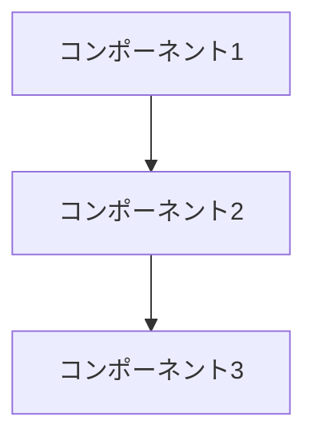

# システム仕様書

## 1. 基本情報
- システム名称：[システム名]
- バージョン：[バージョン番号]
- 最終更新日：[YYYY-MM-DD]
- ステータス：[ドラフト/レビュー中/承認済み]

## 2. 概要
### 2.1 目的
[システムの主な目的や解決する課題を記載]

### 2.2 対象ユーザー
[システムの主なユーザーや利用者層を記載]

## 3. 機能要件
### 3.1 必須機能
1. [機能1]
   - 詳細説明
   - 入力項目
   - 出力項目
   - バリデーションルール

2. [機能2]
   - ...

### 3.2 オプション機能
1. [オプション機能1]
   - ...

## 4. 非機能要件
### 4.1 性能要件
- レスポンス時間
- 同時接続数
- データ容量

### 4.2 セキュリティ要件
- 認証方式
- アクセス制御
- データ保護

### 4.3 運用要件
- バックアップ
- メンテナンス
- モニタリング

## 5. 技術仕様
### 5.1 システム構成


### 5.2 使用技術
- フロントエンド：[技術スタック]
- バックエンド：[技術スタック]
- データベース：[DB種類]
- インフラ：[インフラ構成]

## 6. データモデル
### 6.1 エンティティ定義
```typescript
interface EntityName {
  id: string;
  // プロパティ定義
}
```

### 6.2 リレーション
[エンティティ間の関係性を記載]

## 7. インターフェース仕様
### 7.1 API仕様
```typescript
interface APIRequest {
  // リクエスト定義
}

interface APIResponse {
  // レスポンス定義
}
```

## 8. テスト要件
### 8.1 テスト項目
- 単体テスト
- 結合テスト
- E2Eテスト

## 9. 制約事項
- 技術的制約
- ビジネス制約
- 法的制約

## 10. 付録
### 10.1 用語集
| 用語 | 説明 |
|------|------|
| 用語1 | 説明1 |
| 用語2 | 説明2 |

### 10.2 参考資料
- [参考資料1]
- [参考資料2]